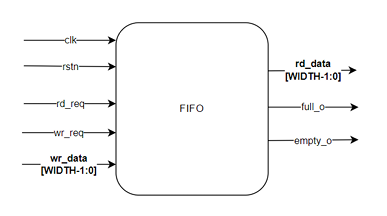

# fifo-verification-systemverilog
**In this project, I developed a SystemVerilog testbench to verify the behavior of a given FIFO
module design (`fifo.sv`).**
The testbench generates randomized input transactions, drives them into the FIFO, and monitors the output. A verification monitor captures the transactions, while a reference model checks the output to ensure the FIFO is functioning correctly according to its specifications.

## FIFO Specification

* The FIFO has the following interface ports:
  - clk
  - rstn
  - rd_req
  - wr_req
  - wr_data[WIDTH – 1:0] 
  - rd_data[WIDTH – 1:0]
  - full_o
  - empty_o

  
* The FIFO has 2 parameters: WIDTH, describing the number of bits in each vector element, and 
DEPTH, describing how many element slots are in the FIFO. The defaults are WIDTH = 32, DEPTH 
= 4.

* The FIFO is a synchronous module reacting to the clk and rstn signals. All activity is synchronized to 
the positive edge of the clock and the FIFO will reset when rstn goes low.

***Assumptions***
* There are never parallel read and write requests.
* There will always be a gap of at least 1 idle clock cycle between a read and the following 
request.

 

 

